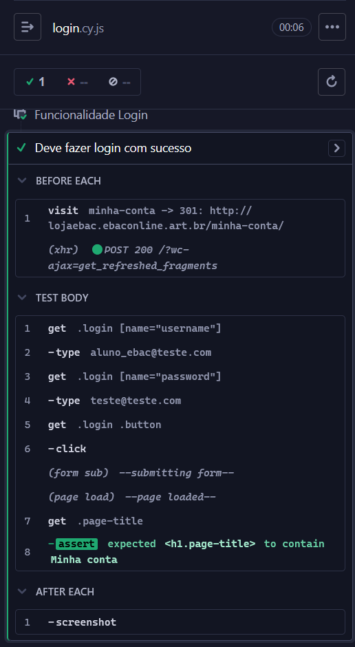
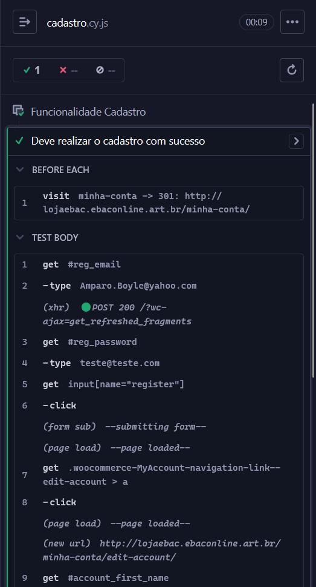
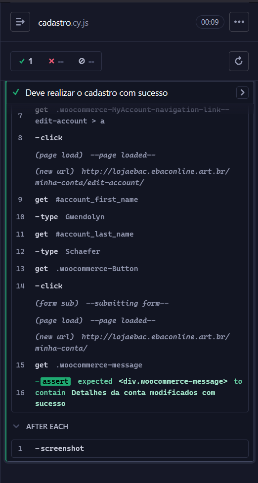
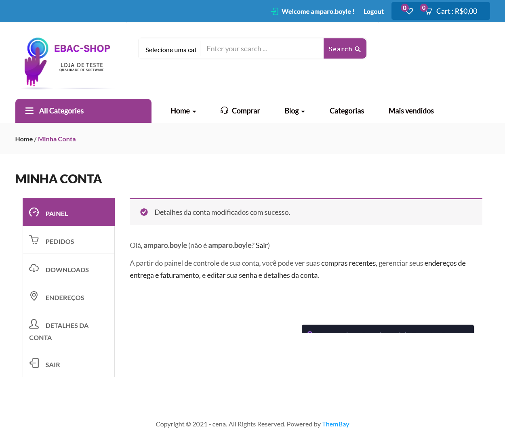
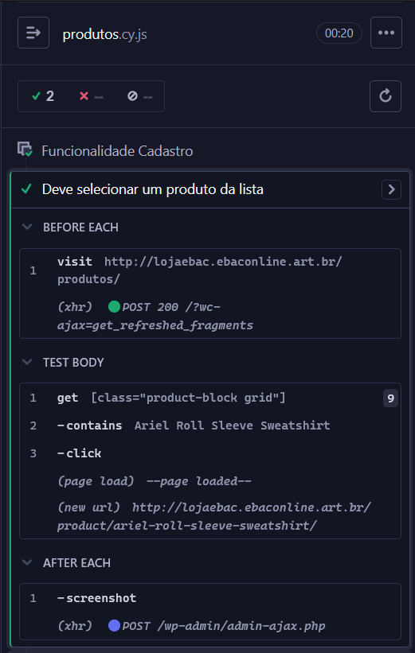
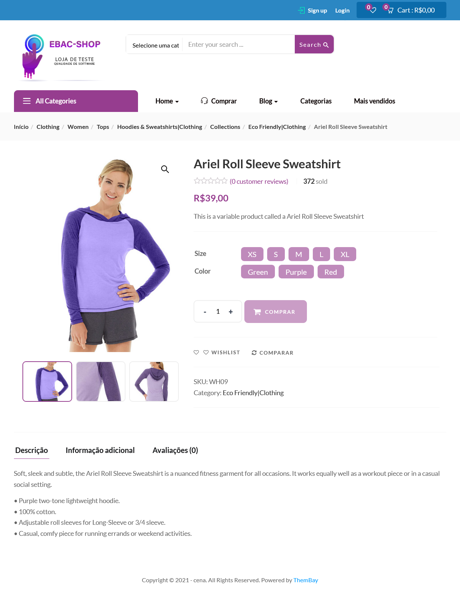
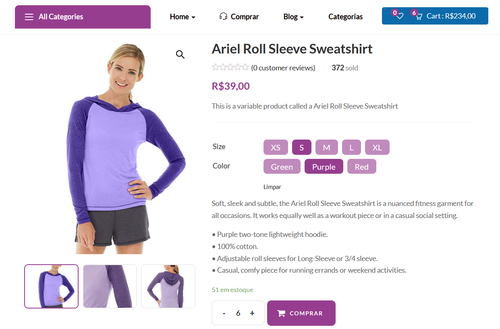
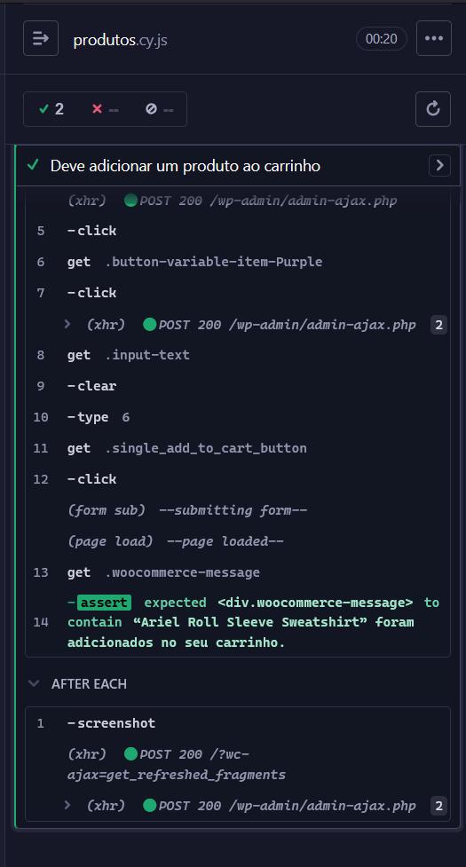

# cypress-ecommerce-automation

Automação de testes de ponta a ponta (E2E) em plataforma de e-commerce utilizando Cypress e Faker.js.
Projeto desenvolvido como parte da formação em Engenharia de Qualidade de Software da **EBAC**.

Este projeto foca na validação de fluxos críticos de negócio, garantindo que funcionalidades essenciais como autenticação, cadastro e o processo de compra operem conforme os requisitos, minimizando riscos de regressão e falhas na experiência do usuário.

## 🛠️ Tecnologias Utilizadas

* **Cypress**: Framework principal para automação de testes E2E.
* **JavaScript**: Linguagem base para o desenvolvimento dos scripts.
* **Faker.js**: Biblioteca utilizada para geração de dados dinâmicos e aleatórios.
* **Node.js**: Ambiente de execução e gerenciamento de dependências.

---

## 🧪 Plano de Testes e Execução

Abaixo estão os cenários de teste mapeados e o status atual da automação:

| ID | Cenário | Status | Técnica Utilizada |
|:---|:---|:---:|:---|
| CT01 | Realizar login com credenciais válidas | ✅ Passou | Seletores de CSS e Assertions |
| CT02 | Realizar pré-cadastro com dados aleatórios | ✅ Passou | Massa de dados dinâmica (Faker.js) |
| CT03 | Adicionar produto ao carrinho | ✅ Passou | Seletores de Classe e Validação de Quantidade |

---

### 🔑 Detalhes da Execução: CT01 - Login com Sucesso

**Objetivo:** Garantir que um usuário previamente cadastrado consiga acessar sua conta e ser redirecionado para o painel de controle ("Minha conta").

  
📸 Clique aqui para ver as evidências de Login

  #### 1. Logs de execução (Cypress Runner)
  Este print demonstra o passo a passo dos comandos executados pelo robô e a asserção (assertion) de sucesso confirmando o login.
  

  #### 2. Interface da página logada
  Visualização da página de destino após a autenticação bem-sucedida, capturada automaticamente via screenshot.
  

---

### 👤 Detalhes da Execução: CT02 - Pré-cadastro e Perfil

**Objetivo:** Validar a criação de uma nova conta utilizando dados dinâmicos e a complementação do perfil do usuário na área logada.

  
📸 Clique aqui para ver as evidências de Cadastro

  #### 1. Fluxo de Cadastro e Edição (Cypress Runner)
  Este print demonstra o uso do **Faker.js** para gerar e-mails e nomes aleatórios, permitindo que o teste seja executado infinitas vezes sem repetição de dados.
  
  

  #### 2. Confirmação de Alteração
  Visualização da mensagem de sucesso: *"Detalhes da conta modificados com sucesso"*, validando o fim do fluxo.
  

---
---

### 🛒 Detalhes da Execução: CT03 - Adição ao Carrinho

**Objetivo:** Validar o fluxo de seleção de produtos com variações (tamanho e cor), ajuste de quantidade e inserção no carrinho de compras.

🔍 Nota técnica: Devido à ausência de IDs únicos nos seletores de variações, este cenário foi automatizado utilizando classes específicas e seletores de atributo para garantir a precisão do clique.

  
📸 Clique aqui para ver as evidências de Compra

  #### 1. Seleção de Variações e Quantidade
  Execução da lógica de seleção por classes específicas e ajuste dinâmico da quantidade antes da inserção no carrinho.
  
  

  #### 2. Carrinho Atualizado
  Validação da mensagem de sucesso e confirmação de que os itens foram corretamente contabilizados no sistema do e-commerce.

  
  
  

## 🚀 Como executar o projeto
Para rodar estes testes na sua máquina, siga os passos abaixo:
1. Pré-requisitos

É necessário ter o Node.js instalado. Você pode baixá-lo em nodejs.org.
2. Instalação

Clone este repositório e, dentro da pasta do projeto, execute o comando abaixo para instalar o Cypress e o Faker.js:
Bash

npm install

3. Execução dos Testes

Existem duas formas de rodar os testes:

A. Interface Visual (Modo Iterativo): Para abrir o painel do Cypress e escolher qual teste rodar visualmente:
Bash

npx cypress open

B. Modo Headless (Terminal): Para rodar todos os testes de uma vez direto no terminal (ideal para CI/CD):
Bash

npx cypress run

## Autora: Nayane Rocha🐱💕👩‍💻
[GitHub](https://github.com/nayanerocha)
[Linkedin](https://www.linkedin.com/in/nayanerocha/)

# Licença: 📄

Este projeto é de código aberto e foi criado para fins educacionais.