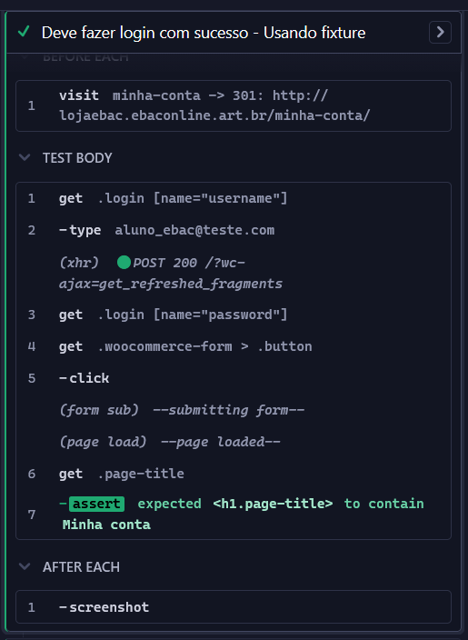
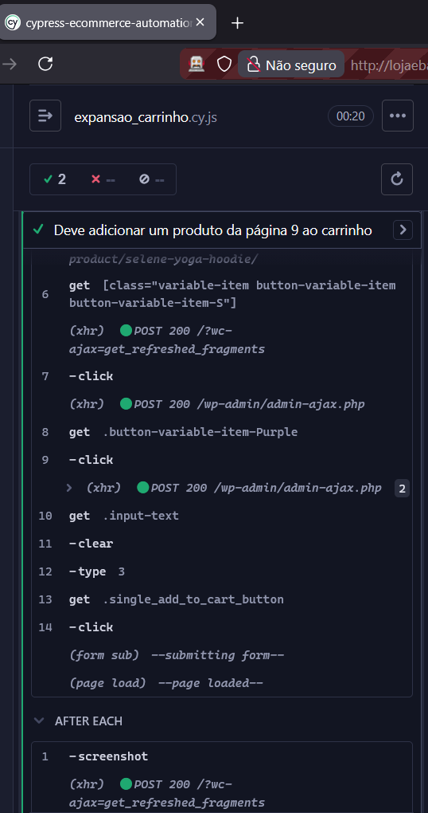
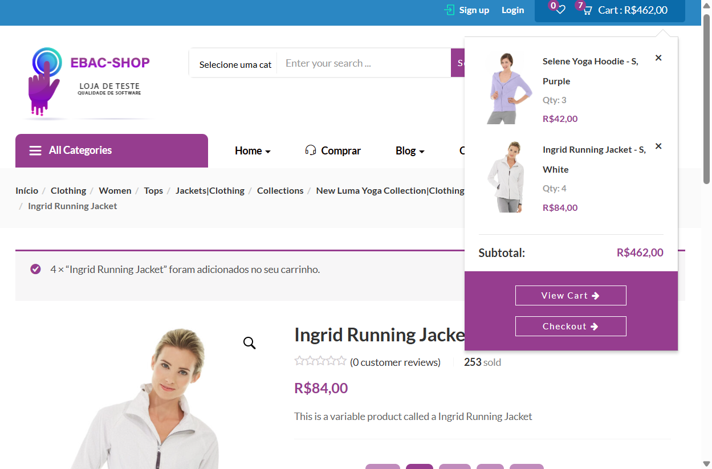

# cypress-ecommerce-automation

Automação de testes de ponta a ponta (E2E) em plataforma de e-commerce utilizando Cypress e Faker.js.
Projeto desenvolvido como parte da formação em Engenharia de Qualidade de Software da **EBAC**.

Este projeto foca na validação de fluxos críticos de negócio, garantindo que funcionalidades essenciais como autenticação, cadastro e o processo de compra operem conforme os requisitos, minimizando riscos de regressão e falhas na experiência do usuário.

## 🛠️ Tecnologias Utilizadas

* **Cypress**: Framework principal para automação de testes E2E.
* **JavaScript**: Linguagem base para o desenvolvimento dos scripts.
* **Faker.js**: Biblioteca utilizada para geração de dados dinâmicos e aleatórios.
* **Node.js**: Ambiente de execução e gerenciamento de dependências.

---

## Plano de Testes e Execução

Abaixo estão os cenários de teste mapeados e o status atual da automação:

| ID | Cenário | Status | Técnica Utilizada |
|:---|:---|:---:|:---|
| CT01 | Realizar login com credenciais válidas | ✅ Passou | Seletores de CSS e Assertions |
| CT02 | Realizar pré-cadastro com dados aleatórios | ✅ Passou | Massa de dados dinâmica (Faker.js) |
| CT03 | Adicionar produto ao carrinho | ✅ Passou | Seletores de Classe e Validação de Quantidade |

---

### 🛒 Detalhes da Execução: CT01 - Funcionalidade de Login

**Objetivo:** Validar o acesso à plataforma, garantindo que usuários cadastrados acessem suas contas com sucesso e que tentativas com dados inválidos sejam bloqueadas com mensagens de erro apropriadas.

**Nota técnica:** Implementei o uso de arquivos de dados (**Fixtures**) para separar a massa de teste do código principal. Para garantir a privacidade em demonstrações, utilizei o parâmetro `{ log: false }` no campo de senha, impedindo a exibição do dado sensível no log de execução do Cypress.

  
📸 Clique aqui para ver as evidências de Login

  #### 1. Login com Sucesso
  Validação do redirecionamento para o painel de controle ("Minha conta") após inserção de credenciais válidas.
  

  #### 2.  Login com Sucesso (Data Driven)
  Uso de credenciais válidas extraídas do arquivo `perfil.json`.
  

  #### 3. Mascaramento de Senha (Segurança)
  Evidência do Cypress Runner ocultando o valor da senha durante o comando `.type()`.
  

  #### 4. Tratamento de Usuário Inválido
  Verificação da mensagem de erro e do bloqueio de acesso ao inserir um e-mail não cadastrado no sistema.
  

  #### 4. Logs de Execução (Cypress Runner)
  Passo a passo dos comandos e asserções (assertions) executados pelo Cypress, garantindo a integridade do fluxo de autenticação.
  

#### 5. Otimização com Comandos Customizados
Implementação do comando `cy.login(usuario, senha)` no arquivo `commands.js`. Esta abstração permite a reutilização do fluxo de autenticação em diferentes suítes de teste, reduzindo a duplicidade de código.

---

### Detalhes da Execução: CT02 - Pré-cadastro e Perfil

**Objetivo:** Validar a criação de uma nova conta utilizando dados dinâmicos e a complementação do perfil do usuário na área logada.

  
📸 Clique aqui para ver as evidências de Cadastro

  #### 1. Fluxo de Cadastro e Edição (Cypress Runner)
  Este print demonstra o uso do **Faker.js** para gerar e-mails e nomes aleatórios, permitindo que o teste seja executado infinitas vezes sem repetição de dados.
  
  

  #### 2. Confirmação de Alteração
  Visualização da mensagem de sucesso: *"Detalhes da conta modificados com sucesso"*, validando o fim do fluxo.
  

#### 3. Uso de Comandos Customizados
Implementação do comando `cy.preCadastro()`, que automatiza desde o registro inicial até a edição dos detalhes da conta. 

#### 4. Estabilidade e Validações de Interface
O uso de comandos customizados incluiu asserções avançadas como `.should('be.enabled')` para garantir que os campos de Nome e Sobrenome estejam prontos para interação, além de esperas dinâmicas com `timeout` para lidar com a latência do servidor.

#### 5. Evolução da Massa Dinâmica (Faker.js)
Atualização dos scripts para utilizar a versão mais recente da biblioteca (`faker.person.firstName()`), garantindo que a geração de dados permaneça compatível com as melhores práticas de desenvolvimento.

---

### Detalhes da Execução: CT03 - Produtos (Adição ao carrinho)

**Objetivo:** Validar o fluxo de seleção de produtos com variações (tamanho e cor), ajuste de quantidade e inserção no carrinho de compras.

Nota técnica: Devido à ausência de IDs únicos nos seletores de variações, este cenário foi automatizado utilizando classes específicas e seletores de atributo para garantir a precisão do clique.

  
📸 Clique aqui para ver as evidências de Compra

  #### 1. Seleção de Variações e Quantidade
  Execução da lógica de seleção por classes específicas e ajuste dinâmico da quantidade antes da inserção no carrinho.
  
  

  #### 2. Carrinho Atualizado
  Validação da mensagem de sucesso e confirmação de que os itens foram corretamente contabilizados no sistema do e-commerce.

  
  
  

---

## ⚠️ Decisão Técnica: Comandos Customizados no Teste de Produtos

### Contexto
Durante a implementação do comando customizado `addProdutos()`, foram identificadas inconsistências significativas na estrutura HTML do site de testes.

### Problema Técnico
O site possui uma implementação inconsistente dos seletores de tamanho e cor:
* **Tamanho:** Requer seletor de atributo completo `[class="variable-item button-variable-item button-variable-item-S"]`.
* **Cor:** Funciona com seletor de classe simples `.button-variable-item-Purple`.

Esta inconsistência torna o comando customizado excessivamente complexo e frágil, exigindo lógica condicional ou múltiplas estratégias de seleção para lidar com diferentes tipos de atributos.

### Decisão e Justificativa
Optou-se por **não aplicar comandos customizados** neste cenário específico. 

**Justificativa:**
1. **Objetivo de Aprendizado Atingido:** O conceito de Custom Commands foi compreendido e aplicado com sucesso em outros fluxos (Login e Cadastro).
2. **Manutenibilidade:** A manutenção de seletores diretos neste caso garante maior legibilidade. 
3. **Custo-benefício:** O tempo necessário para contornar as falhas estruturais do site de testes não justifica o ganho educacional, sendo mais estratégico focar na evolução para os próximos módulos.

---

### Detalhes da Execução: CT04 - Testes de Navegação e Múltiplos Itens

**Objetivo:** Validar a persistência do carrinho ao navegar entre páginas distintas do catálogo (Página 9 e Página 5) e a adição de múltiplos produtos com variações de tamanho e cor.

**Nota técnica:** Para otimizar a estabilidade do teste e contornar elementos de interface que sobrepunham a paginação, utilizei a estratégia de **navegação direta via URL** (`cy.visit()`). Além disso, apliquei **lógica de programação** através do uso de variáveis para armazenar os nomes dos produtos, tornando o código mais limpo, legível e de fácil manutenção.

  
📸 Clique aqui para ver as evidências da Expansão

  #### 1. Adição do Primeiro Produto (Página 9)
  Navegação direta para a página 9 e seleção do produto **"Selene Yoga Hoodie"** com suas respectivas variações.

    
    
  

  #### 2. Adição do Segundo Produto (Página 5)
  Navegação direta para a página 5 e seleção do produto **"Selene Yoga Hoodie"** com suas respectivas variações. Transição para a página 5 e adição de novo item. Validação final confirmando que o sistema manteve o primeiro produto, atualizando corretamente o subtotal.

    
    
    
  

---

## Estratégia de Testes

Para garantir a qualidade da expansão do e-commerce, utilizei uma abordagem híbrida que combina o planejamento manual com a eficiência da automação.

### 1. Testes Manuais (Cenários de Negócio)
Antes de automatizar, realizei o levantamento de cenários críticos para validar as regras de negócio e a experiência do usuário (UX):

- **CT-001:** Validação de persistência de múltiplos itens no carrinho.  
- **CT-002:** Bloqueio de compra sem seleção de atributos (Cor/Tamanho).  
- **CT-003:** Feedback visual em buscas por termos inexistentes.

### 2. Automação de Testes (Cypress)
Os cenários de fluxo de ponta a ponta (E2E) foram automatizados para garantir a confiabilidade do sistema e evitar regressões.

**Destaques Técnicos:**
- **Navegação Otimizada:** Uso de `cy.visit()` dinâmico.
- **Data Driven Testing:** Uso de **Fixtures** para isolar massa de dados.
- **Segurança:** Mascaramento de logs em campos sensíveis.
- **Manutenibilidade:** Uso de variáveis para evitar *hardcoded strings*.

---

## Como executar o projeto
Para rodar estes testes na sua máquina, siga os passos abaixo:
1. Pré-requisitos

É necessário ter o Node.js instalado. Você pode baixá-lo em nodejs.org.
2. Instalação

Clone este repositório e, dentro da pasta do projeto, execute o comando abaixo para instalar o Cypress e o Faker.js:
Bash

npm install

3. Execução dos Testes

Existem duas formas de rodar os testes:

A. Interface Visual (Modo Iterativo): Para abrir o painel do Cypress e escolher qual teste rodar visualmente:
Bash

npx cypress open

B. Modo Headless (Terminal): Para rodar todos os testes de uma vez direto no terminal (ideal para CI/CD):
Bash

npx cypress run

## Autora: Nayane Rocha🐱💕👩‍💻
[GitHub](https://github.com/nayanerocha)
[Linkedin](https://www.linkedin.com/in/nayanerocha/)

### Licença: 📄

Este projeto é de código aberto e foi criado para fins educacionais.

